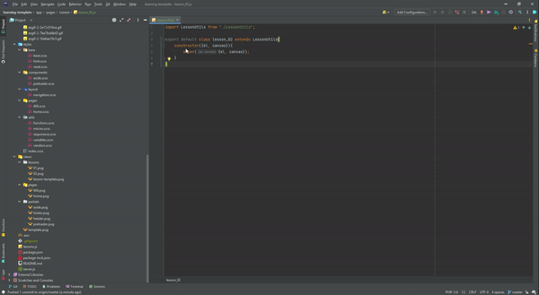
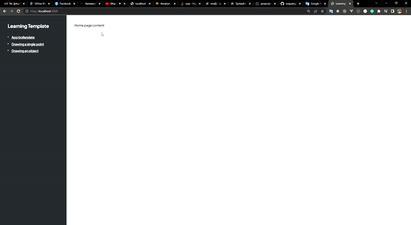

# Learning Template

During my learning process, I have built this. But when I looked back, I thought that I have spent more and more times
to build this site for my learning, and it helped me very much. I don't need to create a dev server for dev-mode or
install and config some library to build production site.

With all the best, hope you like it

> Loading another page => NOT Barba.js, just a simple function that I have written

## Demo site


## How to use

### Step 1:

- Add new lesson in `lessons.js`
- Create new `lesson.pug` file
- Create new `lesson.js` file (with class base template)



### Step 2:

- Open dev server -> that's enough



## Deployment

Run `./public` in dev mode

```shell
npm start
```

Build files from `./src` and `./public` to `./dist` for production and run in production mode

```shell
npm run build
```
